# Flea Finder Stockholm
Django project for Code Institute (PP4)

## General Information
Flea finder Stockholm is a meeting place for people interested in markets in Stockholm. It’s a tool for vendors/event makers to share their events. And for shoppers/tourists/market conousseurs it’s a place where you can easily find a wonderful market to go to.

Registered users  are able to interact with the content by creating (updating and deleting), commenting on and liking posts.

#### [Link to deployed website](https://flea-market-sthlm-fc73d9ace203.herokuapp.com/)

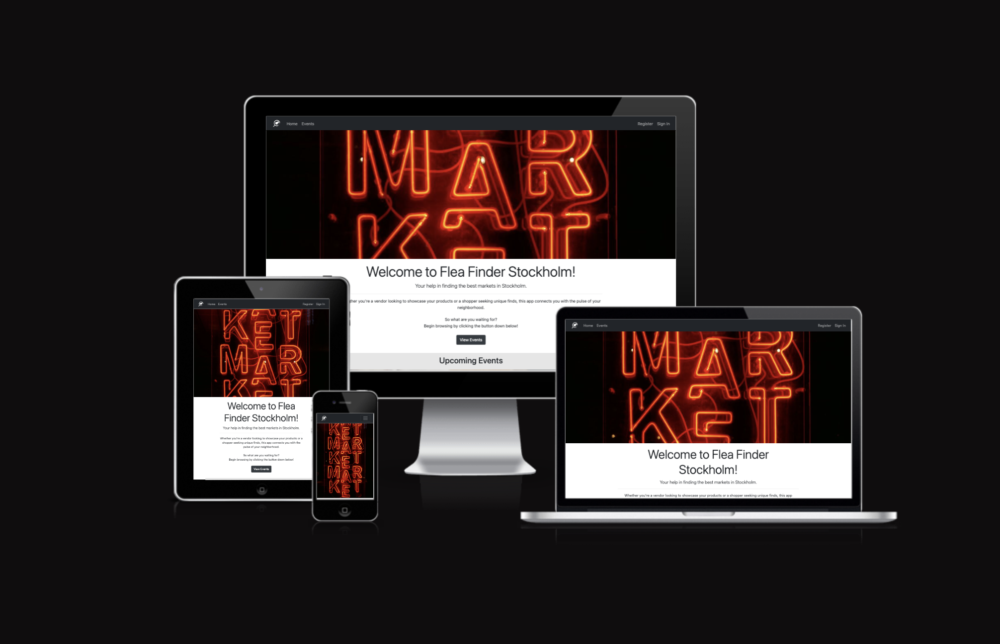

## Table of Contents

  - ### [UX](#ux-1)
  - ### [Project Goals](#project-goals-1)
  - ### [User Stories](#user-stories-1)
  - ### [Features](#features-1)
  - ### [Database Design](#database-design)
  - ### [Testing](#testing-1)
    - #### [Validator Testing](#validatior-testing-1)
    - #### [Testing User Stories](#testing-user-stories-1)
    - #### [Manual Testing](#manual-testing-1)
    - #### [Future Improvements](#future-improvements-1)
  - ### [Bugs](#bugs-1)
  - ### [Libraries and Software](#libraries-and-software-1)
  - ### [Deployment](#deployment-1)
  - ### [Github Pages](#github-pages-1)
  - ### [Credits](#credits-1)

## UX
The main concept for the site is simplicity, therefore the pages have a simple structure, and general. 

This website is designed to follow the conventions of a typical blog site and the general functionality is designed to be intuitive, meeting the users expectations of a standard blog site. 

A simple colour scheme based on a gradient between white to dark gray was used for contrast and calm. 

There's a nice favicon to make the site easier to find and look good in the tab bar.

### Wireframe
The wireframe was created using balsamiq.

Nav and Home Page

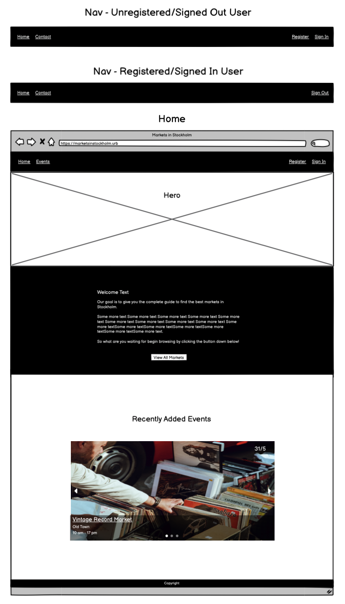

Post List and Category View

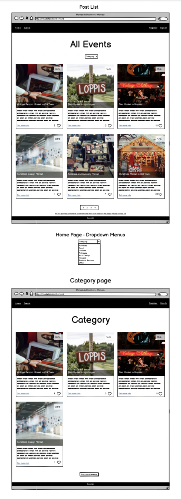

Post Detail

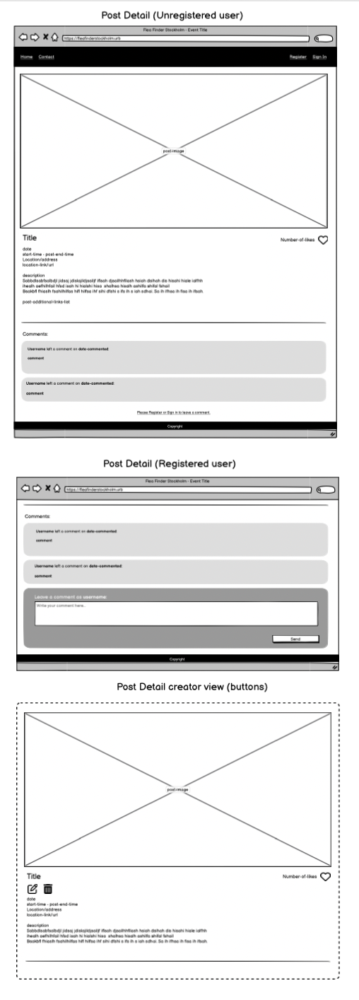

Create, Update, Delete Post

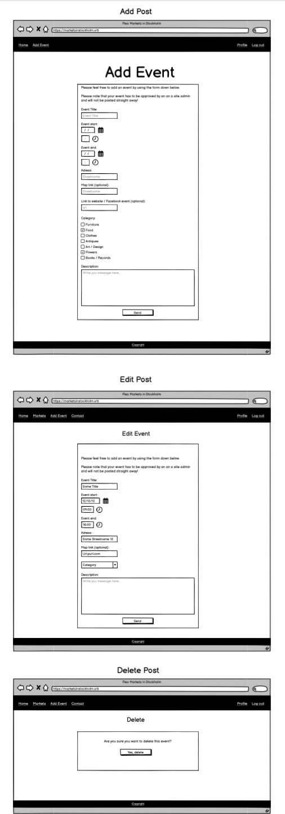

Register, Sign In / Out

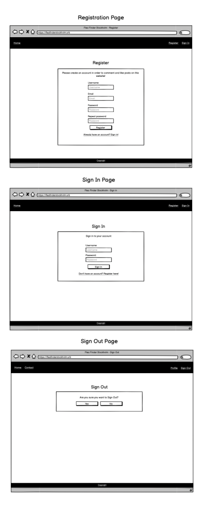

### Agile
This project was designed using an agile approach from start to finish. I Used the Git Hub projects function to plan this project and assigned them labels according to their importance.

To adress the users need I initially made a mindmap where I wrote out potential features and then prioritized and tried to keep the most important, weeding out features and information that the user will not need, at least in the first implementation of the project. This was especially considered when creating the database models and for the event detail and event view.

### Colour scheme
The main colours used for the webpage are:

- Navbar, footer, buttons: #212529
- Image Overlays, Text(for light bg-color): black
- Background Body, Text(for dark bg-color): white

## Project Goals
The main goal of the site was to create a website using the Django Framework in Python along with HTML and CSS. 

Users should  be able to: 
 - Register an account. 
 - Sign In/Out.
 - Find Events they are interested in.
 - Add their own events.
 - Update and delete their own events.
 - Comment and like events.

## User Stories

To view the User stories in the project please click on this [link](https://github.com/users/AlmaBroman/projects/3).

Please note that the user stories all have a label signifying their importance and a label grouping them to a specific epic.

| **EPIC** | **ID #** | **User Story** | **Github project** |
|-------------|------------|---------------------|---------------------|
| **Account Registration** |
|  | 1 | As a Site User I can register an account so that I can post, comment and like posts | [Link](https://github.com/users/AlmaBroman/projects/3/views/1?pane=issue&itemId=46192303) |
| **Home Page** |
|  | 24 | As a Site User I can view the home page so that easily understand the purpose of the website | [Link](https://github.com/users/AlmaBroman/projects/3/views/1?pane=issue&itemId=52980235) |
| **Post List** |
|  | 5 | As a Site User I can view a paginated list of posts so that I can easily select a page to view | [Link](https://github.com/users/AlmaBroman/projects/3/views/1?pane=issue&itemId=46193056) |
|  | 6 | As a Site User I can view a list of posts so that I can select one to read | [Link](https://github.com/users/AlmaBroman/projects/3/views/1?pane=issue&itemId=46193253) |
|  | 8 | As a Site User / Admin I can view the number of likes on each post so that I can see which is the most popular or viral | [Link](https://github.com/users/AlmaBroman/projects/3/views/1?pane=issue&itemId=46193462) |
|  | 9 | As a Site User I can click on a post so that I can read the full text | [Link](https://github.com/users/AlmaBroman/projects/3/views/1?pane=issue&itemId=46193561) |
|  | 17 | As a Site User I can filter the post list by categories so that I can easily select a post to view | [Link](https://github.com/users/AlmaBroman/projects/3/views/1?pane=issue&itemId=52981163) |
| **Posts** |
|  | 13 | As a Site User I can like or unlike a post so that i can interact with the content | [Link](https://github.com/users/AlmaBroman/projects/3/views/1?pane=issue&itemId=46194124) |
|  | 19 | As a registered user I can add posts so that I can interact with the website | [Link](https://github.com/users/AlmaBroman/projects/3/views/1?pane=issue&itemId=49805609) |
|  | 23 | As a registered site user and creator of the post I can update a post i myself have created so that I can manage my own post | [Link](https://github.com/users/AlmaBroman/projects/3/views/1?pane=issue&itemId=52979742) |
| **Admin** |
|  | 3 | As a Site Admin I can create, read, update and delete posts so that I can manage my blog content | [Link](https://github.com/users/AlmaBroman/projects/3/views/1?pane=issue&itemId=46192736) |
|  | 20 | As a Site Admin I can create, read, update and delete comments so that I can manage my blog content | [Link](https://github.com/users/AlmaBroman/projects/3/views/1?pane=issue&itemId=52966548) |
|  | 21 | As a Site Admin I can view, update and delete information about registered users so that I can manage my blog content | [Link](https://github.com/users/AlmaBroman/projects/3/views/1?pane=issue&itemId=52967085) |
|  | 22 | As a Site Admin I can create, read, update and delete categories so that I can manage my blog content | [Link](https://github.com/users/AlmaBroman/projects/3/views/1?pane=issue&itemId=52967739) |
| **Comments** |
|  | 10 | As a Registered User I can leave comments on a post so that I can interact with the content | [Link](https://github.com/users/AlmaBroman/projects/3/views/1?pane=issue&itemId=46193747) |
|  | 11 | As a Site User I can view comments on an individual post so that I can read the conversation | [Link](https://github.com/users/AlmaBroman/projects/3/views/1?pane=issue&itemId=46193921) |
| **NOT IMPLEMENTED!** |
|  | 14 | As a Site User I can Write a message so that I can leave feedback on the site-content and/or suggest events | [Link](https://github.com/users/AlmaBroman/projects/3/views/1?pane=issue&itemId=52981084) |
|  | 15 | As a Site Admin I can view messages from Site User so that I can respond to messages and/or consider the feedback submitted | [Link](https://github.com/users/AlmaBroman/projects/3/views/1?pane=issue&itemId=52981223) |
|  | 25 | As a site user I can sort posts by number of likes so that i can easily find a post to read based on whats most popular | [Link](https://github.com/users/AlmaBroman/projects/3/views/1?pane=issue&itemId=52980611) |
---

## Features

- nav
- footer
- home page
- events
- category
- non existing category
- event detail
- add event
- register
- sign in
- sign out
- 404

Browse through different categories like: food, clothes, antiques, seasonal and more. 

Add/update/delete your own event and tell everyone about your amazing, upcoming market. 

Comment and like events you find interesting or want to know more about!

Create an account that you can sign in and out to!

like posts!

## Database Design

Database model diagram

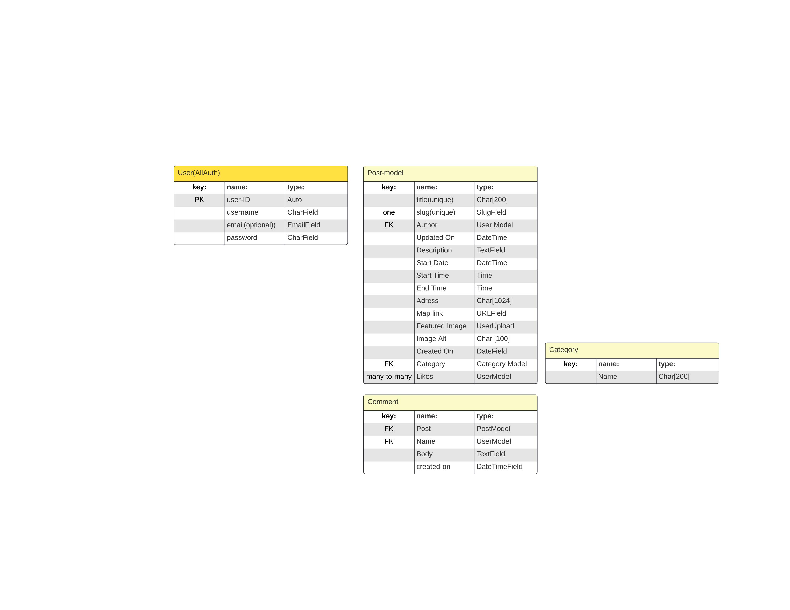
This diagram was created using lucid chart. The post model was based on the "i think therfore i blog" project and then adapted and customised to this project. 

--- 
## Testing

### Tested Browsers
- Google Chrome: Everything works as expected.

lighthouse issues!

---
### Validatior Testing

#### HTML
All HTML files has passed through validation:

index.html

post_list.html

post_detail.html

categories.html

404.html

delete_post.html

logout.html

login.html

signup.html

Note: The validator throws 4 errors, however after double checking the code and researching these issues it seems as if the html and the errors are coming from Django forms interpretation of allauths helper text and not the code i myself have written.

add_post.html

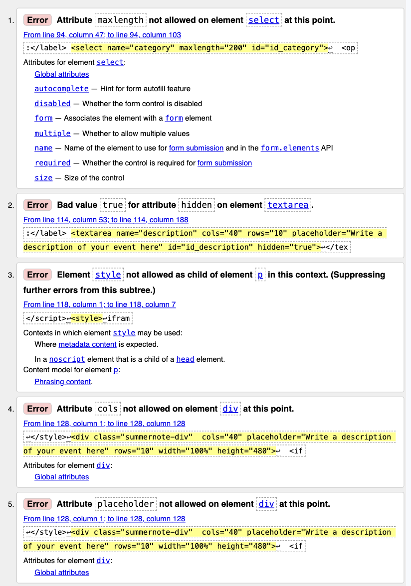
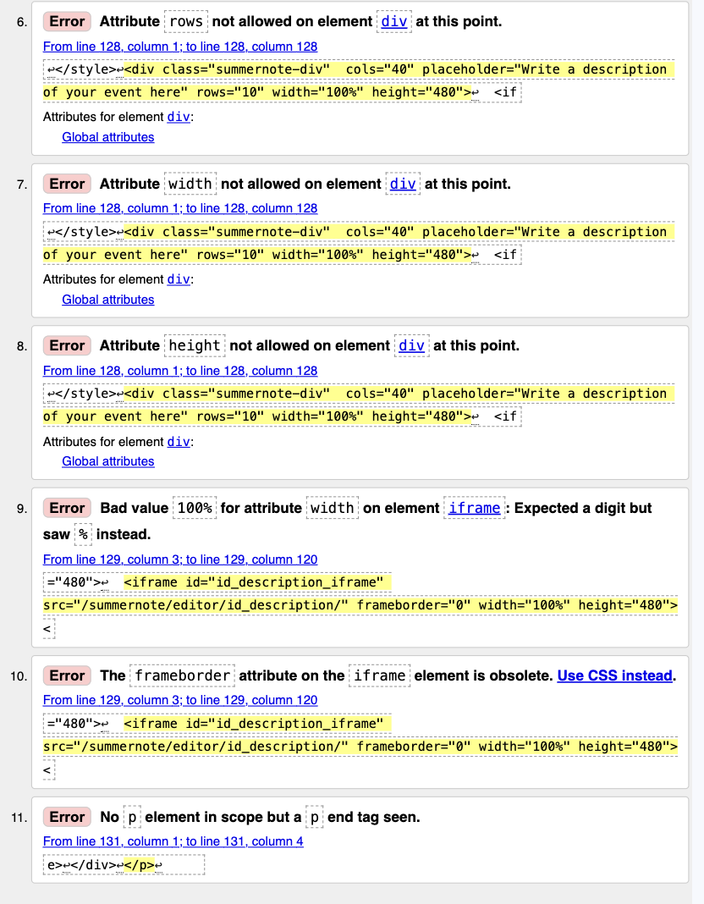

Note: The validator throws 11 errors, however most of these errors seem to relate to the rendering of the summernote field. The two errors that are not related to summernote are coming from the rendering of the post categories as a select field rather than a charfield, which is expected from the model. I've decided leave these errors as is, since the form is functioning correctly otherwise.

update_post.html

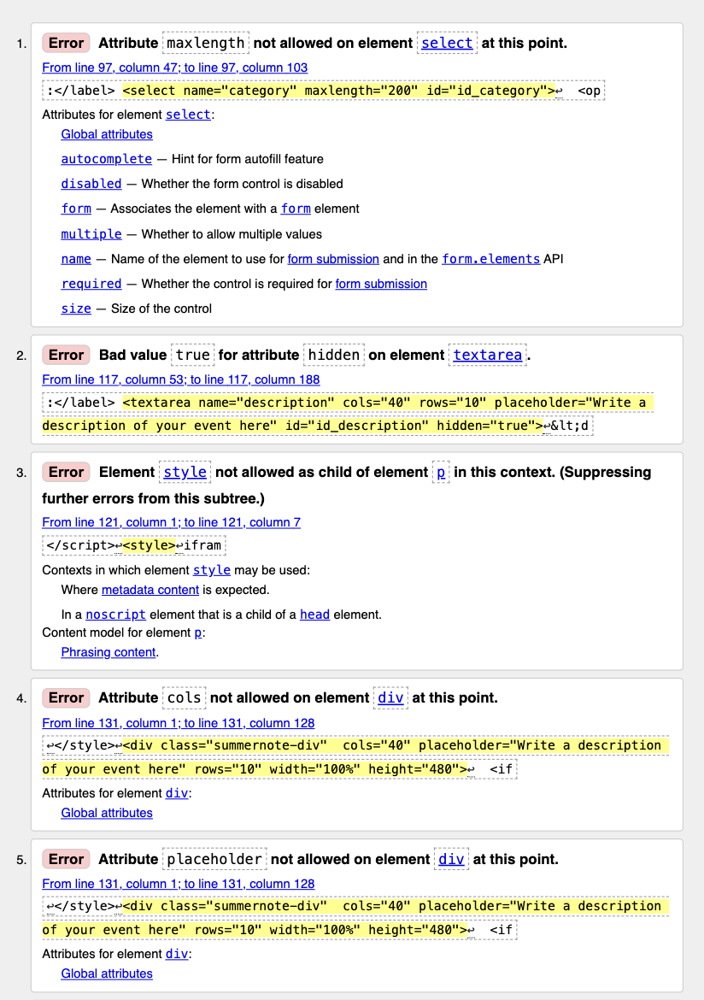
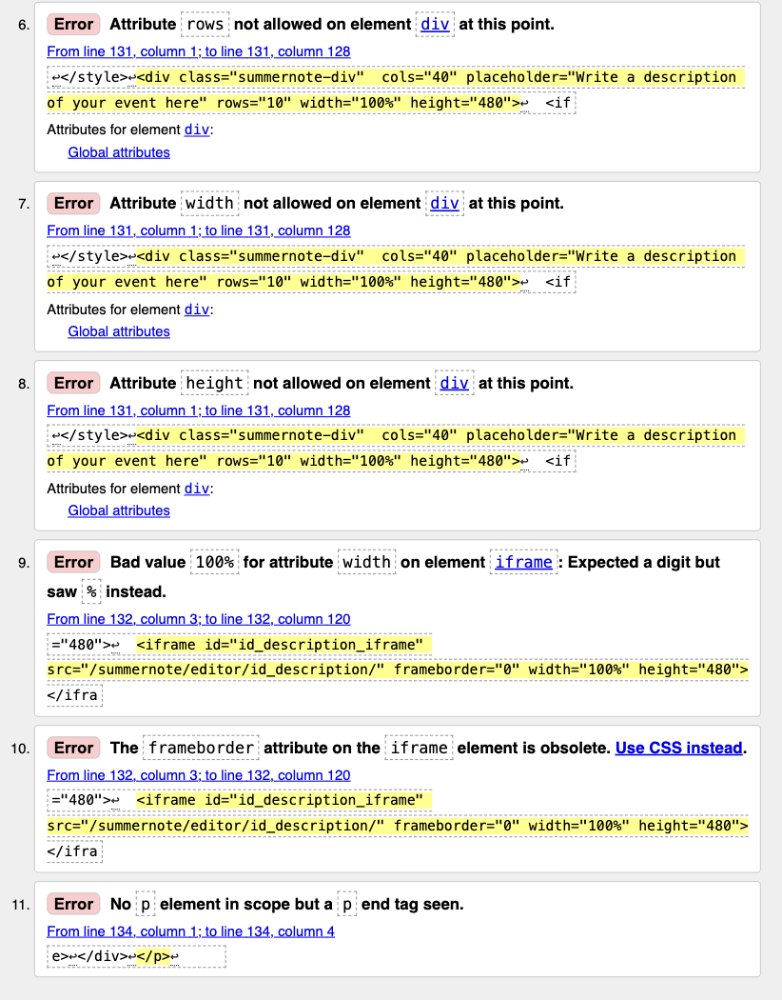

Note: The validator throws 11 errors, however most of these errors seem to relate to the rendering of the summernote field. The two errors that are not related to summernote are coming from the rendering of the post categories as a select field rather than a charfield, which is expected from the model. I've decided leave these errors as is, since the form is functioning correctly otherwise.

#### CSS
All CSS files has passed through validation and shows no errors:

CSS Validation

Translation: Congratulations! No errors were found

#### Python
All Python files has passed through validation:

admin.py

apps.py

asgi.py

blog > urls.py

forms.py

marketsthlm > urls.py

models.py

settings.py

Note: Although the validator states an error I've chosen to leave the line too long as its only one character over the standard and breaking it up would make it harder to read.

views.py

wsgi.py

### Manual Testing
manual testing/test user stories
All manual testing and tests of user Stories was made using Google Chrome.

Navigation

All navigation links, including home icon, can be found in navbar or on small to medium screens in the burger drop-down menu.

| Feature | Action                             | Expected Result                 |
| :-----: | :---------------------------------:| :------------------------------:|
| **Home Link Icon** | While not on homepage, click icon. | Icon shrinks and expands. User is redirected back to homepage. |
| **"Home" Link** | While not on homepage, click "Home". | User is redirected back to homepage. |
| **"Login" Link** | While not authenticated, click "Login". | User is directed to Login form. |
| **"Sign Up" Link** | While not authenticated, click "Sign Up". | User is directed to Sign Up form. |
| **"Add Event" Link** | While authenticated, click "Add Event". | User is directed to Add Event form. |
| **"Logout" Link** | While authenticated, click "Logout". | User is directed to page with Sign Out button. |

Home Page

| Feature | Action                             | Expected Result                 |
| :-----: | :---------------------------------:| :------------------------------:|
| **"View Events" button** | On home page, click "View Events" | User is redirected to Events page. |
| **"Carousel" next/previous** | On home page, in carousel click ">" or "<" | Next carousel slide is shown. |
| **"Carousel read more" link** | On home page, in carousel click "read more" | Redirects user to post detail page. |

Events

| Feature | Action                             | Expected Result                 |
| :-----: | :---------------------------------:| :------------------------------:|
| **Events view** |  Click on event link in nav | Renders a paginated page with all of the posts in the post list. |
| **"Filter by Category" dropdown menu** | On events page, click "filter by category" | Shows a list of all available categories. |
| **"Category" dropdown menu link** | On events page in "filter by category" dropdown menu, click "category" | redirects user to category page |
| **"Post Card" link** |  On events page, click anywhere on "card" | Redirects user to post detail |
| **Pagination "next" button** |  On events page, click "next" button  | Show next page |
| **Pagination "previous" button** |  On events page, click "next" button  | Show previous page |

Category Page

| Feature | Action                             | Expected Result                 |
| :-----: | :---------------------------------:| :------------------------------:|
| **Category view** |  Go to category via dropdown menu on the event page | Renders a page with all of the posts from the selected category |
| **Non existent/empty category** | Trying to access a nonexistent category url | Renders an error message and a back button |
| **"Post Card" link** |  On category page, click anywhere on "card" | Redirects user to post detail |
| **"Back" button** |  On category page, click "Back" button  | Redirects user to Events page |

Post Detail

| Feature | Action                             | Expected Result                 |
| :-----: | :---------------------------------:| :------------------------------:|
| **View post detail** |  When clicking on a post detail link. | Page renders with all of the Post details (img, title, date, time, location(-link), event description) |
| **No Location Link** | When clicking on a post detail link, with no location link | Page renders with location stated (not as a link)|
| **Location Link** | In post detail view, location link, click | New tab is opened with stated link|
| **View post detail** |  When clicking on a post detail link. | Page renders with Post detail |
| **View comments** |  When clicking on a post detail link. | Page renders with all comments related to the respective post |
| **Submit comment** |  When signed in, In post detail view, scroll down to comment form and blank textfield input. Write a comment. Click "Submit". | The new comment appears in the list of comments. |
| **Like** |  In post detail view, click like button (heart icon) below post image of post that is already liked. | Icon color changes from filled to lined. Like count is decremented by 1. |
| **Unlike** |  In post detail view, click like button (heart icon) below post image of post that isn't already liked. | Icon color changes from lined to filled. Like count is incremented by 1. |
| **"Register" or "sign in" links** | when not signed in, in post detail view, scroll down to "register" or "sign in" to comment" links, click either | user is redirected to register, or sign in page accordingly |
| **View "Delete" icon** | When signed in, In post detail view of post created by the user that is currently logged in | delete button is rendered below post title |
| **View "Edit" icon** | When signed in, In post detail view of post created by the user that is currently logged in | Edit button is rendered below post title |
| **"Edit" icon link** | Edit icon, click | Update post form renders with pre-populated form fields |

Add Post

| Feature | Action                             | Expected Result                 |
| :-----: | :---------------------------------:| :------------------------------:|
| **Title Field** |  Select title field and start typing. | Placeholder disappears, title shows instead. Typing is disabled after 200 characters. |
| **Date Field** |  Select date field and start typing. | Placeholder disappears, dates shows instead. Only numbers are admitted |
| **Date picker** |  Select date field, click calendar icon, click on date in calendar. | Placeholder disappears, selected date shows instead. |
| **Time field** |  Select time field and start typing. | Placeholder disappears, selected time shows instead. Only numbers, only accepted time values |
| **Time picker** |  Select time field, click clock icon, select numbers in timepicker. | Placeholder disappears, selected time shows instead. |
| **Adress Field** |  Select adress field and start typing. | Placeholder disappears, adress shows instead. |
| **Map Link** |  Select Map link field and start typing. | Placeholder disappears, adress link shows instead. |
| **Image Upload** | Image(optional), click choose  | User can choose file on their computer and add upload it. |
| **Image Description** |  Select Image description field and start typing. | Placeholder disappears, Image description shows instead. |
| **Category Dropdown** |  category select dropdown, click | select menu list of available categorys to choose from |
| **Select Category** |  catgory in category dropdown, click | category is shown as selected |
| **Description Field** |  Select description field and start typing. | Placeholder disappears, description shows instead. |
| **Submit** |  After completing post form correctly click submit button | Alert message informs user of successful submission. User is re-directed to homepage. |
| **Incomplete Form** |  Fill out post form incorrectly, click submit button | User remains on "Create" page and is prompted to complete missing fields. |

Update Post

| Feature | Action                             | Expected Result                 |
| :-----: | :---------------------------------:| :------------------------------:|
| **Submit** |  After completing post form correctly click submit button | Alert message informs user of successful submission. User is re-directed to homepage. |
| **Incomplete Form** |  Fill out post form incorrectly, click submit button | User remains on "Create" page and is prompted to complete missing fields. |

Delete Post

| Feature | Action                             | Expected Result                 |
| :-----: | :---------------------------------:| :------------------------------:|
| **"Delete" button** |  on delete page, click delete | Alert message informs user of successful deletion. User is re-directed to homepage, selected haiku has been deleted. |
| **"Cancel" button** |  on delete page, click cancel | User is redirected to homepage, without deleting the post |

Register

| Feature | Action                             | Expected Result                 |
| :-----: | :---------------------------------:| :------------------------------:|
| **Registration form** |  Go to Registration page via nav link | Renders form input fields Username, Email (optional), Password, Password (confirm). |
| **Submit** |  Fill in form fields accordingly. Click "Register". | Self-closing message informs user of successfull account creation. User is re-directed to homepage and navigation shows links for authenticated users. |
| **Incomplete form** |  Failing to fill out all form fields, click "Register". | User remains on Register form view and is prompted to complete missing fields. |

Sign in

| Feature | Action                             | Expected Result                 |
| :-----: | :---------------------------------:| :------------------------------:|
| **Sign in form** |  go to sign in page via nav link | Renders form input fields, username, password |
| **Submit** |  Fill in form fields correctly. click "sign in" | Self-closing message informs user of successfull sign in, including username. User is re-directed to homepage and navigation shows links for authenticated users. |
| **Incomplete form** |  Failing to fill out all form fields, click "Sign In". | User remains on Sign in form view and is prompted to complete missing fields. |

Sign Out

| Feature | Action                             | Expected Result                 |
| :-----: | :---------------------------------:| :------------------------------:|
| **Sign out form** |  When authenticated, go to sign out page via nav link | User is redirected to logout page, asking user to confirm action |
| **Sign Out** |  On Sign out page, click "Sign Out" | Self-closing message informs user of successfull logout. User is re-directed to homepage and navigation shows links for unauthenticated users. |

Admin

| Feature | Action                             | Passed               |
| :-----: | :---------------------------------:| :------------------------------:|
| **Manage Categories** |  When admin is signed in on the admin page admin is able to create update and delete any categories | Confirmed |
| **Manage Posts** |  When admin is signed in on the admin page, admin is able to create update and delete any posts | Confirmed |
| **Manage Comments** |  When admin is signed in on the admin page, admin is able to create update and delete any comments | Confirmed |
| **Manage Users** | When admin is signed in on the admin page, admin is able to create update and delete any users | Confirmed |

### Future Improvements

 ### Lighthouse test

 Due to the way Images are handled on the site the lighthouse test shows poor performance when loading the page, this has been noted and will be improved and implemented in the future.

Lighthouse test

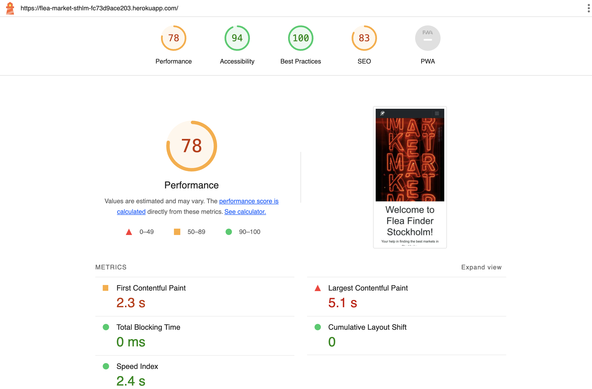

### Add Post, Update post html validation errors
The add post and update post html validation showed errors, as stated in the html validation section of this document, this is noted and will be looked at and implemented in the future.

### User redirections for update and add post
When user has updated and added a post the user is redirected to the home page, for improved ux the user should however be redirected to the corresponding post detail page, this will be looked at and implemented in the future.

## Bugs

### Fixed Bugs
| Bug | Solution                             |
| :-----: | :---------------------------------:|
| **Failing to upload images to cloudinary** | set cloudinary vars in settings.py  |
| **Static files not showing on deployed site** | settings.py debug false, base template - {{load static}}  |

### Unsolved Bugs
The developer has fixed all the bugs that has been found so far.

---
## Languages, Libraries and Software
### Main Languages:
- HTML5
- CSS3
- Python
- Django

### Modules/ Packages used:
Most important packages:
- django: Python web framework used to develop the site.
- psycopg2: PostgreSQL database for the Python programming lanugage.
- dj3-cloudinary-storage: Integrates Cloudinary with Django Storage API.
- django-allauth: Integrates user authentication aswell as 3rd party account authientication such as facebook and other social accounts.
- Gunicorn: Gunicorn is a pure-Python HTTP server for WSGI applications.
- Summernote: a java script library used to create a custom text editor.

### Frameworks and Websites used:
- Gitpod: Used for version control and to commit and push code to github.
- Github: Github is used to store the projects code after being pushed from gitpod. 
- Heroku: Used to deploy the project online.
- PostgreSQL(ElephantSQL): Used as Database.
- Cloudinary: Used to host all images on the site.
- LucidChart: Used to create the Database Schema (flowchart?).
- Balsamiq: Used to create the Wireframes for the site.
- Font Awesome: Used for icon implementation on the site.
- Bootstrap: Used for responsivness and layout.
- Canva: Used to create favicon.
- Favicon.io : Used to convert favicon.

---
## Deployment
#### Creating the Heroku app
Install Django and Gunicorn:
- Step 1: pip3 install 'django<4' gunicorn

Install supporting libraries:
- Step 2: pip3 install dj_database_url==0.5.0 psycopg2

Install Cloudinary Libraries:
- Step 3: pip3 install dj3-cloudinary-storage
- Step 4: pip3 install urllib3==1.26.15

Create the requirements.txt file:
- Step 5: pip3 freeze --local > requirements.txt

Create the project (Do NOT forget the dot at the end! Replace PROJ_NAME with your own projects name. ):
- Step 6: django-admin startproject PROJ_NAME .

Create the app (Replace APP_NAME with your own app name):
- Step 7: python3 manage.py startapp APP_NAME

- Step 8: Add the installed app to installed apps in settings.py (In my example my project and app name are 'marketsthlm' and 'blog'):
    

    
Installed apps example:

    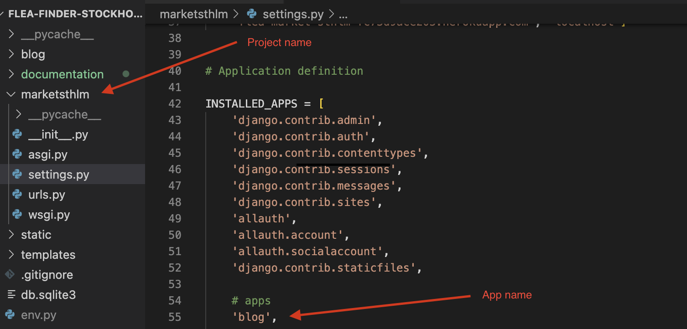
    

Migrate the changes:
- Step 9: python3 manage.py migrate

Run the server to test that it all works.
- Step 10: python3 manage.py runserver

You will now see a yellow error screen when viewing the site:

- Step 11: Copy the link on the screen and add it to your "Allowed Host" in your settings.py file(Here I have both my Heroku link and the local link, you should add your Heroku link here aswell when the project is deployed).
    

    
Allowed hosts example

    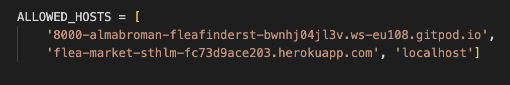
    

 Create the Database using ElephantSQL
- Step 12: Log in, or create an account at [ElephantSQL](https://elephantsql.com/).
- Step 13: Click "Create new instance".
- Step 14: Choose a name for your project.
- Step 15: Choose your plan (Choose Tiny Turtle for the free option).
- Step 16: Tags are optional to fill out, then press "Select region".
- Step 17: Choose the region closest to you.
- Step 18: Return to the dashboard and choose your newly created project.
- Step 19: Under "Details", find the URL for your database and copy it. The link starts with "postgres://...." (We will use this soon)

Back to creating the Heroku APP.
- Step 20: Login to Heroku and click "New" -> "Create new app" to start a new project.
- Step 21: Choose an "app name" and "Region" - Then press "Create app".

Adding Config Vars

- Step 22: Click on Settings tab, and choose "Reveal Config Vars"
- Step 23: As key type: DATABASE_URL
- Step 24: As value: "The link you copied earlier from ElephantSQL".

Creating the env.py file to store all your sensitive information.
- Step 25: Create a file named "env.py" at the root of your directory.
- Step 26: At the top of the file type: import os

Adding the database URL:
- Step 27: os.environ["DATABASE_URL"] = "The link you copied earlier from ElephantSQL"

Adding the Secret Key (either make up your own or use the one in settings.py(Your project CANNOT have been pushed to github if you use the one in settings.py!)):
- Step 28: os.environ["SECRET_KEY"] = " Secret key goes here "

Add the Secret key to herokus config vars.
- Step 29: As Key: SECRET_KEY
- Step 30: As Value: "The secret key you have in env.py"

Settings.py:
- Step 31: At the top of the file add the following code:

import os

import dj_database_url

if os.path.isfile('env.py'):
    import env

from pathlib import Path

Find the SECRET_KEY and replace the secret key code with:
- Step 32: SECRET_KEY = os.environ.get('SECRET_KEY')

- Step 33: Comment out, or delete the following Database code:

DATABASES = {

'default': {

'ENGINE': 'django.db.backends.sqlite3',

'NAME': BASE_DIR / 'db.sqlite3',

}

}

Create the new Database link with the following code:
- Step 34: 

DATABASES = {

'default':

dj_database_url.parse(os.environ.get("DATABASE_URL"))

}

Now we can save all files and migrate all the changes. Make sure that your project has never been pushed or commited to github with the secret key you now have in your env.py file, if so, make up a new secret key.

- Step 35: In the terminal type: python3 manage.py migrate

- Step 36: Login or create an account at [Cloudinary](https://cloudinary.com/).

- Step 37: Copy your CLOUDINARY_URL from the Dashboard.

Add the following code to your env.py file:
- Step 38: os.environ["CLOUDINARY_URL"] = ( The link goes here )
Make sure the link looks like this: ""cloudinary://************************"

In Herokus Config Vars, add the Cloudinary url:
- Step 39: As KEY: CLOUDINARY_URL
- Step 40: As Value: "The same link as in env.py"

- Step 41: As KEY: DISABLE_COLLECTSTATIC
- Step 42: As Value: 1

- Step 43: As KEY: PORT
- Step 44: As Value: 8000

- Step 44.2: As KEY: DEBUG
- Step 44.3: As Value: FALSE

#### In Settings.py

Add Cloudinary Libraries to installed apps (The order is important!)

- Step 45: Add the following code:

    INSTALLED_APPS = [

    'cloudinary_storage', <- This is new

    'django.contrib.staticfiles', (This was here before...)

    'cloudinary', <- This is new

    ]

Telling Django to use Cloudinary for media and static files:

- Step 46: Add the following code:

    STATIC_URL = '/static/'
    STATICFILES_STORAGE = ('cloudinary_storage.storage.'
                        'StaticHashedCloudinaryStorage')
    STATICFILES_DIRS = [os.path.join(BASE_DIR, 'static'), ]
    STATIC_ROOT = os.path.join(BASE_DIR, 'staticfiles')

    MEDIA_URL = '/media/'
    DEFAULT_FILE_STORAGE = 'cloudinary_storage.storage.MediaCloudinaryStorage'

    DEFAULT_AUTO_FIELD = 'django.db.models.BigAutoField'

Link all templates files

- Step 47: Place the following code beneath BASE_DIR:

    TEMPLATES_DIR = os.path.join(BASE_DIR, 'templates')

Change template directory within the templates array:
- Step 48: Add the following code:

    'DIRS': [TEMPLATES_DIR],

- Step 49: Do step 11 again, only this time add the HEROKU link aswell.

Create 3 new folders at the root of the directory
- Step 50: media, static, templates

Creat the Procfile at the root of the directory (Note the capital P)
- Step 51: Create Procfile
- Step 52: Add the following code to the Procfile:

    web: gunicorn Your-project-name.wsgi

Now we are all set to deploy the project to Heroku.
- Step 53: Navigate to Settings and under buildpacks, add:"heroku/python"
- Step 54: Navigate to Heroku and choose Deploy.
- Step 55: Deployment method, Link your Github.
- Step 56: Connect your app to Github.
- Step 57: Choose Automatic, or Manual Deploy (I Recommend Automatic).

- Step 58: Choose Deploy Branch.

Your project will now build and be ready to use. Good luck!

---
## Github Pages
- This project was developed using Gitpod which I used to commit and push to GitHub using the terminal in GitPod.(Note that this project was deployed to Heroku and that those steps also must be followed.)
### Here are the steps to deploy a website to GitHub Pages from its GitHub repository:

- Log in to GitHub and locate the GitHub Repository.
- At the top of the Repository, locate the Settings button on the menu.
- Under Source, click the dropdown called None and select Main Branch.
- The page will refresh automatically and generate a link to your website.
### Forking the GitHub Repository
- By forking the GitHub Repository we make a copy of the original repository on our GitHub account to view and/or make changes without affecting the original repository by using the following steps...

- Log in to GitHub and locate the GitHub Repository.
- At the top of the Repository (not top of page) just above the "Settings" Button on the menu, locate the "Fork" Button.
- You should now have a copy of the original repository in your GitHub account.
### Making a Local Clone
- Log in to GitHub and locate the GitHub Repository
- Under the repository name, click "Clone or download".
- To clone the repository using HTTPS, under "Clone with HTTPS", copy the link.
- Open Git Bash
- Change the current working directory to the location where you want the cloned directory to be made.
- Type git clone, and then paste the URL you copied in Step 3. $ git clone https://github.com/YOUR-USERNAME/YOUR-REPOSITORY
- Press Enter. Your local clone will be created.

## Credits
The official Django Documentation was used throughout creating this project. The skeleton of this project is based on the Code Institute tutorials "Hello Django" and "I Think Therefore I Blog". For further guidance on syntax and implementation of features I also referred to Codemy, Just Soondar and Dee Mc Django tutorials. Below is a detailed list of the sources i've used and short descriptive titles for how the respective source was used.

### Resources

 - [Django documentation](https://docs.djangoproject.com/en/5.0/)
 - [Bootstrap Documentation](https://getbootstrap.com/docs/4.3/getting-started/introduction/)
 - [W3Schools](https://www.w3schools.com/)
 - [Summernote Documentation](https://github.com/summernote/django-summernote?tab=readme-ov-file)
 - [Cloudinary Documentation](https://cloudinary.com/documentation)
 - [ElephantSQL Documentation](https://www.elephantsql.com/docs/index.html)
 - [CodeInstitute - tutor support, slack, mentoring, course content](https://codeinstitute.net/se/full-stack-software-development-diploma/?utm_term=code%20institute&utm_campaign=CI+-+SWE+-+Search+-+Brand&utm_source=adwords&utm_medium=ppc&hsa_acc=8983321581&hsa_cam=14660337051&hsa_grp=134087657984&hsa_ad=635849372549&hsa_src=g&hsa_tgt=kwd-319867646331&hsa_kw=code%20institute&hsa_mt=e&hsa_net=adwords&hsa_ver=3&gad_source=1&gclid=Cj0KCQiAw6yuBhDrARIsACf94RUO531QI7q6X9yAB3s7GS_rSIc2x9qXt_eLbx6DJlR3phHXgUaEboEaAs7nEALw_wcB)
 - [OrdinaryCoders - Using django form fields and widgets](https://ordinarycoders.com/blog/article/using-django-form-fields-and-widgets)
 - [good read on how to design a database](https://www.databasestar.com/how-to-design-a-database/)
 - [Custom 404](https://studygyaan.com/django/django-custom-404-error-template-page)
 - [Codemy - Category Pages tutorial](https://www.youtube.com/watch?v=_ph8GF84fX4&ab_channel=Codemy.com)
 - [Just Soondar - Carousel tutorial](https://www.youtube.com/watch?v=vbmXKfnVkms&ab_channel=JustSoondar)
 - [Dee Mc Django - User upload to cloudinary](https://www.youtube.com/watch?v=_GNvmwvvS70&list=PLXuTq6OsqZjbCSfiLNb2f1FOs8viArjWy&index=9&ab_channel=DeeMc)

### Sketching Tools
 - [Balsamiq](https://balsamiq.com/?gad_source=1&gclid=Cj0KCQiAw6yuBhDrARIsACf94RWFuAI1AvoLD-OVge1dnsbZQ276DU-1lOZ9UUqGoY65dpZD1PvbQAYaAsFqEALw_wcB)
 - [LucidChart](https://www.lucidchart.com/pages/landing?utm_source=google&utm_medium=cpc&utm_campaign=_chart_en_tier2_mixed_search_brand_exact_&km_CPC_CampaignId=1520850463&km_CPC_AdGroupID=57697288545&km_CPC_Keyword=lucid%20chart&km_CPC_MatchType=e&km_CPC_ExtensionID=&km_CPC_Network=g&km_CPC_AdPosition=&km_CPC_Creative=442433237648&km_CPC_TargetID=kwd-55720648523&km_CPC_Country=2752&km_CPC_Device=c&km_CPC_placement=&km_CPC_target=&gad_source=1&gclid=Cj0KCQiAw6yuBhDrARIsACf94RWItUjtdfLb1-MmV01hLZvhrfGIHssS2dPuAUo9ObeQCwYlvmeGp5caAsvrEALw_wcB)

### Content
 - [Chat Gpt](https://chat.openai.com/) - Note: Chat Gpt was used in this project solely for writing content/event descriptions for example posts and was not used for any coding.
 
### Media
 - [Favicon.io - Favicon Converter](https://favicon.io/favicon-converter/)
 - [Canva - Creating favicon](https://www.canva.com/)
 - Image for Homepage - [Katherine Germain - Unsplash](https://unsplash.com/photos/red-market-sign-iIWCjgK3704)
 - Placeholder Image - [Carl Tronders - Unsplash](https://unsplash.com/photos/a-green-wheelbarrow-with-a-sign-that-says-lops-on-it-1s1wBXwJalA)
 - Images used in posts and on home page were sourced from [Unsplash](https://unsplash.com/), [Pixabay](https://pixabay.com/) and [Pexels](https://www.pexels.com/sv-se/)