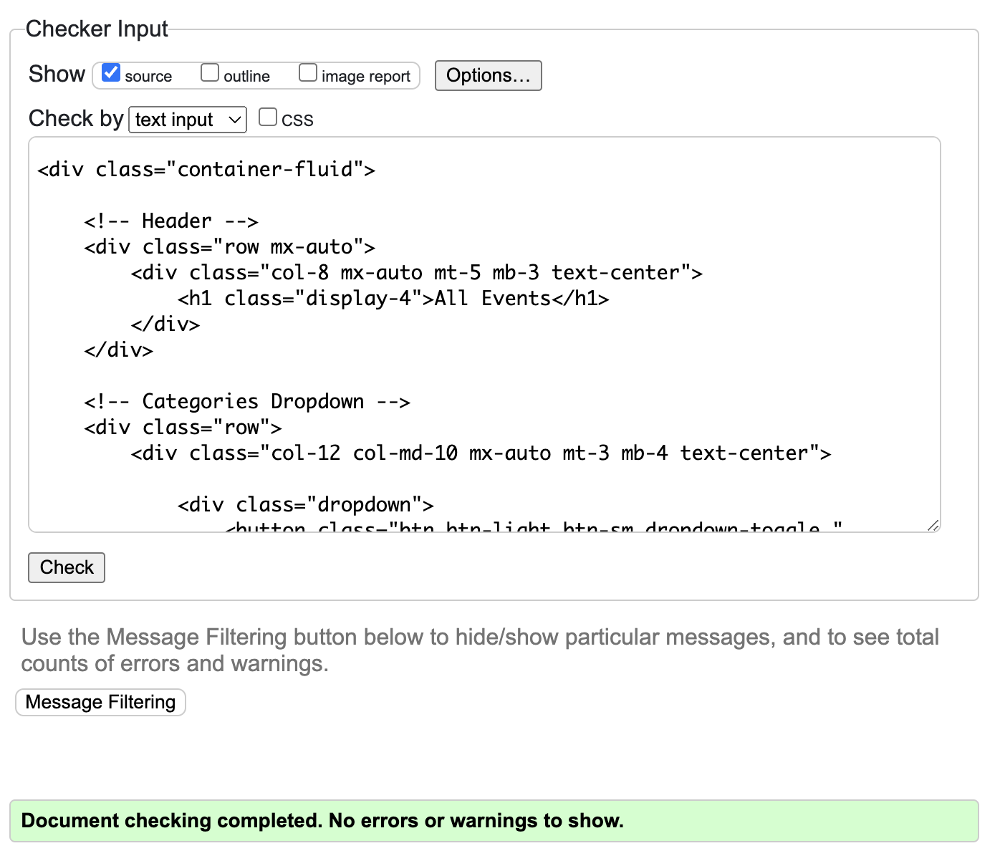
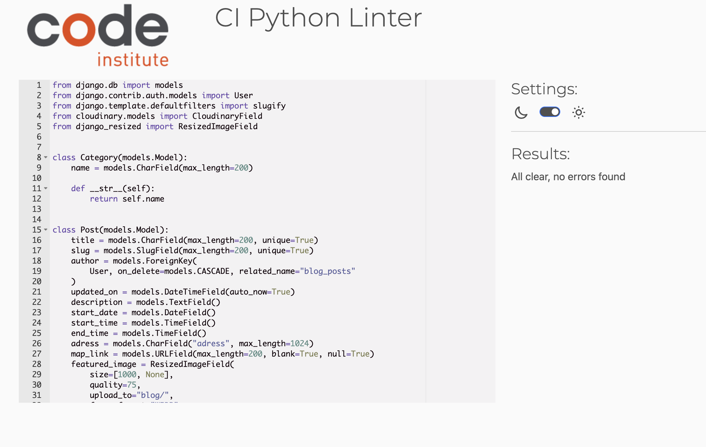

# Flea Finder Stockholm
Django project for Code Institute (PP4)

## General Information
Flea finder Stockholm is a meeting place for people interested in markets in Stockholm. It’s a tool for vendors/event makers to share their events. And for shoppers/tourists/market conousseurs it’s a place where you can easily find a wonderful market to go to.

This Django project is a flea market blog designed to help users find flea markets happening in Stockholm. Unregistered users can view the content, but not interact much with it besides from reading posts and comments and filling out a contact form. Registered users are able to interact with the content by creating, commenting and liking posts.

*Link to deployed website*

*Screenhots*

## Table of Contents

  - ### [General Information](#general-information)
  - ### [Table of Contents](#table-of-contents-1)
  - ### [UX](#ux-1)
  - ### [Project Goals](#project-goals-1)
  - ### [User Stories](#user-stories-1)
  - ### [Flowchart](#Flowchart-1)
  - ### [General features](#general-features-1)
  - ### [Testing](#testing-1)
    - #### [Code Validation](#code-validation-1)
    - #### [Testing User Stories](#testing-user-stories-1)
    - #### [Manual Testing](#manual-testing-1)
    - #### [Future improvements](#Future-improvements-1)
  - ### [Bugs](#Bugs-1)
  - ### [Libraries and Software](#Libraries-and-Software-1)
  - ### [Final Result](#final-result-1)
  - ### [Deployment](#deployment-1)
  - ### [Github Pages](#github-pages-1)
  - ### [Credits](#credits-1)

## UX
The rule of threes
User in mind
Simple, Intuitive design
Hierarchy of information (post list shows date Title, time location)

### Agile
This project was designed using an agile approach from start to finish. I Used the Git Hub projects function to plan this project and assigned them labels according to their importance.
Increments, Epics…?
Acceptance criteria,
Tasks,

### 5 Planes of UX

Strategy
Scope
Structure
Skeleton
Surface

### Visual Design Choices

Colour scheme

Fonts

Images and icons

bootstrap

FEATURES

Browse through different categories like: food, clothes, antiques, seasonal and more. Add your own event and tell everyone about your amazing, upcoming market. Comment and like events you find interesting or want to know more about!

## Project Goals

Type of website: Blog/Online calendar for flea markets/markets
Target Audience: Tourists, Market-enthusiasts

## User Stories

| **EPIC** | **ID #** | **User Story** | **Github project** |
|-------------|------------|---------------------|---------------------|
| **Account Registration** |
|  | 1 | As a Site User I can register an account so that I can post, comment and like posts | [Link](https://github.com/users/AlmaBroman/projects/3/views/1?pane=issue&itemId=46192303) |
| **Home Page** |
|  | 24 | As a Site User I can view the home page so that easily understand the purpose of the website | [Link](https://github.com/users/AlmaBroman/projects/3/views/1?pane=issue&itemId=52980235) |
| **Post List** |
|  | 5 | As a Site User I can view a paginated list of posts so that I can easily select a page to view | [Link](https://github.com/users/AlmaBroman/projects/3/views/1?pane=issue&itemId=46193056) |
|  | 6 | As a Site User I can view a list of posts so that I can select one to read | [Link](https://github.com/users/AlmaBroman/projects/3/views/1?pane=issue&itemId=46193253) |
|  | 8 | As a Site User / Admin I can view the number of likes on each post so that I can see which is the most popular or viral | [Link](https://github.com/users/AlmaBroman/projects/3/views/1?pane=issue&itemId=46193462) |
|  | 9 | As a Site User I can click on a post so that I can read the full text | [Link](https://github.com/users/AlmaBroman/projects/3/views/1?pane=issue&itemId=46193561) |
|  | 17 | As a Site User I can filter the post list by categories so that I can easily select a post to view | [Link](https://github.com/users/AlmaBroman/projects/3/views/1?pane=issue&itemId=52981163) |
| **Posts** |
|  | 13 | As a Site User I can like or unlike a post so that i can interact with the content | [Link](https://github.com/users/AlmaBroman/projects/3/views/1?pane=issue&itemId=46194124) |
|  | 19 | As a registered user I can add posts so that I can interact with the website | [Link](https://github.com/users/AlmaBroman/projects/3/views/1?pane=issue&itemId=49805609) |
|  | 23 | As a registered site user and creator of the post I can update a post i myself have created so that I can manage my own post | [Link](https://github.com/users/AlmaBroman/projects/3/views/1?pane=issue&itemId=52979742) |
| **Admin** |
|  | 3 | As a Site Admin I can create, read, update and delete posts so that I can manage my blog content | [Link](https://github.com/users/AlmaBroman/projects/3/views/1?pane=issue&itemId=46192736) |
|  | 20 | As a Site Admin I can create, read, update and delete comments so that I can manage my blog content | [Link](https://github.com/users/AlmaBroman/projects/3/views/1?pane=issue&itemId=52966548) |
|  | 21 | As a Site Admin I can view, update and delete information about registered users so that I can manage my blog content | [Link](https://github.com/users/AlmaBroman/projects/3/views/1?pane=issue&itemId=52967085) |
|  | 22 | As a Site Admin I can create, read, update and delete categories so that I can manage my blog content | [Link](https://github.com/users/AlmaBroman/projects/3/views/1?pane=issue&itemId=52967739) |
| **Comments** |
|  | 10 | As a Registered User I can leave comments on a post so that I can interact with the content | [Link](https://github.com/users/AlmaBroman/projects/3/views/1?pane=issue&itemId=46193747) |
|  | 11 | As a Site User I can view comments on an individual post so that I can read the conversation | [Link](https://github.com/users/AlmaBroman/projects/3/views/1?pane=issue&itemId=46193921) |
| **NOT IMPLEMENTED!** |
|  | 14 | As a Site User I can Write a message so that I can leave feedback on the site-content and/or suggest events | [Link](https://github.com/users/AlmaBroman/projects/3/views/1?pane=issue&itemId=52981084) |
|  | 15 | As a Site Admin I can view messages from Site User so that I can respond to messages and/or consider the feedback submitted | [Link](https://github.com/users/AlmaBroman/projects/3/views/1?pane=issue&itemId=52981223) |
|  | 25 | As a site user I can sort posts by number of likes so that i can easily find a post to read based on whats most popular | [Link](https://github.com/users/AlmaBroman/projects/3/views/1?pane=issue&itemId=52980611) |
---

## Flowchart

## General Features

--- 
## Testing

Tested browsers:
- Google Chrome: Everything works as expected.

All manual testing and tests of user Stories was made using Google Chrome.

lighthouse??

---
### Code Validation

#### HTML
All HTML files has passed through validation:

index.html

post_list.html

post_detail.html

categories.html

404.html

delete_post.html

logout.html

login.html

signup.html

Note: The validator throws 4 errors, however after double checking the code it seems as if the html and the errors are coming from Django forms interpretation of allauths helper text.

add_post.html

update_post.html

#### CSS
All CSS files has passed through validation and shows no errors:

CSS Validation

Translation: Congratulations! No errors were found

#### Python
All Python files has passed through validation:

admin.py

apps.py

asgi.py

blog > urls.py

forms.py

marketsthlm > urls.py

models.py

settings.py

Note: Although the validator states an error I've chosen to leave the line too long as breaking it up would make it harder to read"

views.py

wsgi.py

   - Testing user stories
   - Manual Testing
   - future Implementations

## Bugs

---
## Languages, Libraries and Software
### Main Languages:
- HTML5
- CSS3
- Python
- Django

### Modules/ Packages used:
Most important packages:
- django: Python web framework used to develop the site.
- psycopg2: PostgreSQL database for the Python programming lanugage.
- dj3-cloudinary-storage: Integrates Cloudinary with Django Storage API.
- django-allauth: Integrates user authentication aswell as 3rd party account authientication such as facebook and other social accounts.
- Gunicorn: Gunicorn is a pure-Python HTTP server for WSGI applications.
- Summernote: a java script library used for custom text editor.

### Frameworks and Websites used:
- Gitpod: Used for version control and to commit and push code to github.
- Github: Github is used to store the projects code after being pushed from gitpod. 
- Heroku: Used to deploy the project online.
- PostgreSQL(ElephantSQL): Used as Database.
- Cloudinary: Used to host all images on the site.
- LucidChart: Used to create the Database Schema and the Flowchart.
- Balsamiq: Used to create the Wireframes for the site.
- Font Awesome: Used for icon implementation on the site.
- Bootstrap: Used for responsivness and layout.
- Canva: Used to create favicon.
- Favicon.io : Used to convert favicon.

## Final Result
Something about the final result here maybe sample pics?

---
## Deployment
#### Creating the Heroku app
Install Django and Gunicorn:
- Step 1: pip3 install 'django<4' gunicorn

Install supporting libraries:
- Step 2: pip3 install dj_database_url==0.5.0 psycopg2

Install Cloudinary Libraries:
- Step 3: pip3 install dj3-cloudinary-storage
- Step 4: pip3 install urllib3==1.26.15

Create the requirements.txt file:
- Step 5: pip3 freeze --local > requirements.txt

Create the project (Do NOT forget the dot at the end! Replace PROJ_NAME with your own projects name. ):
- Step 6: django-admin startproject PROJ_NAME .

Create the app (Replace APP_NAME with your own app name):
- Step 7: python3 manage.py startapp APP_NAME

- Step 8: Add the installed app to installed apps in settings.py (In my example my project and app name are equestrian and bookings):
    

    
Installed apps example:

    
    

Migrate the changes:
- Step 9: python3 manage.py migrate

Run the server to test that it all works.
- Step 10: python3 manage.py runserver

You will now see a yellow error screen when viewing the site:

- Step 11: Copy the link on the screen and add it to your "Allowed Host" in your settings.py file(Here I have both my Heroku link and the local link, you should add your Heroku link here aswell when the project is deployed).
    

    
Allowed hosts example

    
    

 Create the Database using ElephantSQL
- Step 12: Log in, or create an account at [ElephantSQL](https://elephantsql.com/).
- Step 13: Click "Create new instance".
- Step 14: Choose a name for your project.
- Step 15: Choose your plan (Choose Tiny Turtle for the free option).
- Step 16: Tags are optional to fill out, then press "Select region".
- Step 17: Choose the region closest to you.
- Step 18: Return to the dashboard and choose your newly created project.
- Step 19: Under "Details", find the URL for your database and copy it. The link starts with "postgres://...." (We will use this soon)

Back to creating the Heroku APP.
- Step 20: Login to Heroku and click "New" -> "Create new app" to start a new project.
- Step 21: Choose an "app name" and "Region" - Then press "Create app".

Adding Config Vars

- Step 22: Click on Settings tab, and choose "Reveal Config Vars"
    

    
Heroku Navbar

    
    

- Step 23: As key type: DATABASE_URL
- Step 24: As value: "The link you copied earlier from ElephantSQL".
    

    
Config Vars Example

    
    

Creating the env.py file to store all your sensitive information.
- Step 25: Create a file named "env.py" at the root of your directory.
- Step 26: At the top of the file type: import os

Adding the database URL:
- Step 27: os.environ["DATABASE_URL"] = "The link you copied earlier from ElephantSQL"

Adding the Secret Key (either make up your own or use the one in settings.py(Your project CANNOT have been pushed to github if you use the one in settings.py!)):
- Step 28: os.environ["SECRET_KEY"] = " Secret key goes here "

Add the Secret key to herokus config vars.
- Step 29: As Key: SECRET_KEY
- Step 30: As Value: "The secret key you have in env.py"

Settings.py:
- Step 31: At the top of the file add the following code:

import os

import dj_database_url

if os.path.isfile('env.py'):
    import env

from pathlib import Path

Find the SECRET_KEY and replace the secret key code with:
- Step 32: SECRET_KEY = os.environ.get('SECRET_KEY')
    

    
Secret Key Image

    
    

- Step 33: Comment out, or delete the following Database code:

DATABASES = {

'default': {

'ENGINE': 'django.db.backends.sqlite3',

'NAME': BASE_DIR / 'db.sqlite3',

}

}

Create the new Database link with the following code:
- Step 34: 

DATABASES = {

'default':

dj_database_url.parse(os.environ.get("DATABASE_URL"))

}

Now we can save all files and migrate all the changes. Make sure that your project has never been pushed or commited to github with the secret key you now have in your env.py file, if so, make up a new secret key.

- Step 35: In the terminal type: python3 manage.py migrate

- Step 36: Login or create an account at [Cloudinary](https://cloudinary.com/).

- Step 37: Copy your CLOUDINARY_URL from the Dashboard.

Add the following code to your env.py file:
- Step 38: os.environ["CLOUDINARY_URL"] = ( The link goes here )
Make sure the link looks like this: ""cloudinary://************************"

In Herokus Config Vars, add the Cloudinary url:
- Step 39: As KEY: CLOUDINARY_URL
- Step 40: As Value: "The same link as in env.py"

- Step 41: As KEY: DISABLE_COLLECTSTATIC
- Step 42: As Value: 1

- Step 43: As KEY: PORT
- Step 44: As Value: 8000

- Step 44.2: As KEY: DEBUG
- Step 44.3: As Value: FALSE

#### In Settings.py

Add Cloudinary Libraries to installed apps (The order is important!)

- Step 45: Add the following code:

    INSTALLED_APPS = [

    'cloudinary_storage', <- This is new

    'django.contrib.staticfiles', (This was here before...)

    'cloudinary', <- This is new

    ]

Telling Django to use Cloudinary for media and static files:

- Step 46: Add the following code:

    STATIC_URL = '/static/'
    STATICFILES_STORAGE = ('cloudinary_storage.storage.'
                        'StaticHashedCloudinaryStorage')
    STATICFILES_DIRS = [os.path.join(BASE_DIR, 'static'), ]
    STATIC_ROOT = os.path.join(BASE_DIR, 'staticfiles')

    MEDIA_URL = '/media/'
    DEFAULT_FILE_STORAGE = 'cloudinary_storage.storage.MediaCloudinaryStorage'

    DEFAULT_AUTO_FIELD = 'django.db.models.BigAutoField'

Link all templates files

- Step 47: Place the following code beneath BASE_DIR:

    TEMPLATES_DIR = os.path.join(BASE_DIR, 'templates')

Change template directory within the templates array:
- Step 48: Add the following code:

    'DIRS': [TEMPLATES_DIR],

- Step 49: Do step 11 again, only this time add the HEROKU link aswell.

Create 3 new folders at the root of the directory
- Step 50: media, static, templates

Creat the Procfile at the root of the directory (Note the capital P)
- Step 51: Create Procfile
- Step 52: Add the following code to the Procfile:

    web: gunicorn Your-project-name.wsgi

Now we are all set to deploy the project to Heroku.
- Step 53: Navigate to Settings and under buildpacks, add:"heroku/python"
- Step 54: Navigate to Heroku and choose Deploy.
- Step 55: Deployment method, Link your Github.
- Step 56: Connect your app to Github.
- Step 57: Choose Automatic, or Manual Deploy (I Recommend Automatic).

- Step 58: Choose Deploy Branch.

Your project will now build and be ready to use. Good luck!

---
## Github Pages
- This project was developed using Gitpod which I used to commit and push to GitHub using the terminal in GitPod.(Note that this project was deployed to Heroku and that those steps also must be followed.)
### Here are the steps to deploy a website to GitHub Pages from its GitHub repository:

- Log in to GitHub and locate the GitHub Repository.
- At the top of the Repository, locate the Settings button on the menu.
- Under Source, click the dropdown called None and select Main Branch.
- The page will refresh automatically and generate a link to your website.
### Forking the GitHub Repository
- By forking the GitHub Repository we make a copy of the original repository on our GitHub account to view and/or make changes without affecting the original repository by using the following steps...

- Log in to GitHub and locate the GitHub Repository.
- At the top of the Repository (not top of page) just above the "Settings" Button on the menu, locate the "Fork" Button.
- You should now have a copy of the original repository in your GitHub account.
### Making a Local Clone
- Log in to GitHub and locate the GitHub Repository
- Under the repository name, click "Clone or download".
- To clone the repository using HTTPS, under "Clone with HTTPS", copy the link.
- Open Git Bash
- Change the current working directory to the location where you want the cloned directory to be made.
- Type git clone, and then paste the URL you copied in Step 3. $ git clone https://github.com/YOUR-USERNAME/YOUR-REPOSITORY
- Press Enter. Your local clone will be created.

## Credits

Describe in short how ive used the below stated resources

### Resources

 - [Django documentation](https://docs.djangoproject.com/en/5.0/)
 - [Bootstrap Documentation](https://getbootstrap.com/docs/4.3/getting-started/introduction/)
 - [W3Schools](https://www.w3schools.com/)
 -  [Summernote Documentation](https://github.com/summernote/django-summernote?tab=readme-ov-file)
 - [Cloudinary Documentation](https://cloudinary.com/documentation)
 - [ElephantSQL Documentation](https://www.elephantsql.com/docs/index.html)
 - [CodeInstitute - tutor support, slack, mentoring, course content(I think therfore i blog)](https://codeinstitute.net/se/full-stack-software-development-diploma/?utm_term=code%20institute&utm_campaign=CI+-+SWE+-+Search+-+Brand&utm_source=adwords&utm_medium=ppc&hsa_acc=8983321581&hsa_cam=14660337051&hsa_grp=134087657984&hsa_ad=635849372549&hsa_src=g&hsa_tgt=kwd-319867646331&hsa_kw=code%20institute&hsa_mt=e&hsa_net=adwords&hsa_ver=3&gad_source=1&gclid=Cj0KCQiAw6yuBhDrARIsACf94RUO531QI7q6X9yAB3s7GS_rSIc2x9qXt_eLbx6DJlR3phHXgUaEboEaAs7nEALw_wcB)
 - [OrdinaryCoders - Using django form fields and widgets](https://ordinarycoders.com/blog/article/using-django-form-fields-and-widgets)
 - [good read on how to design a database](https://www.databasestar.com/how-to-design-a-database/)
 - [Custom 404](https://studygyaan.com/django/django-custom-404-error-template-page)

### Youtube
 - [Codemy - django blog tutorial]
 - [Just Soondar - Carousel tutorial](https://www.youtube.com/watch?v=vbmXKfnVkms&ab_channel=JustSoondar)
 - [Dee Mc Django recipe sharing tutorial]

### Sketching Tools
 - [Balsamiq](https://balsamiq.com/?gad_source=1&gclid=Cj0KCQiAw6yuBhDrARIsACf94RWFuAI1AvoLD-OVge1dnsbZQ276DU-1lOZ9UUqGoY65dpZD1PvbQAYaAsFqEALw_wcB)
 - [LucidChart](https://www.lucidchart.com/pages/landing?utm_source=google&utm_medium=cpc&utm_campaign=_chart_en_tier2_mixed_search_brand_exact_&km_CPC_CampaignId=1520850463&km_CPC_AdGroupID=57697288545&km_CPC_Keyword=lucid%20chart&km_CPC_MatchType=e&km_CPC_ExtensionID=&km_CPC_Network=g&km_CPC_AdPosition=&km_CPC_Creative=442433237648&km_CPC_TargetID=kwd-55720648523&km_CPC_Country=2752&km_CPC_Device=c&km_CPC_placement=&km_CPC_target=&gad_source=1&gclid=Cj0KCQiAw6yuBhDrARIsACf94RWItUjtdfLb1-MmV01hLZvhrfGIHssS2dPuAUo9ObeQCwYlvmeGp5caAsvrEALw_wcB)

### Content
 - chat gpt
 
### Media
 - [Faviocon.io - Favicon Converter](https://favicon.io/favicon-converter/)
 - [Canva - Creating favicon](https://www.canva.com/)
 - Images used in posts and on home page